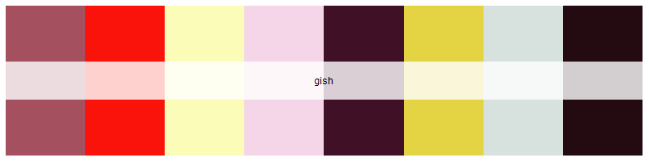
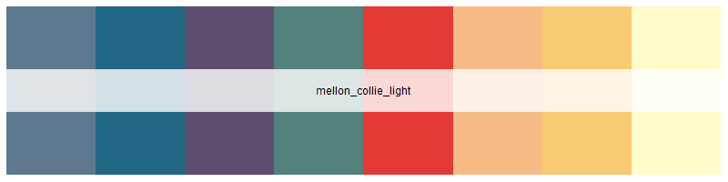
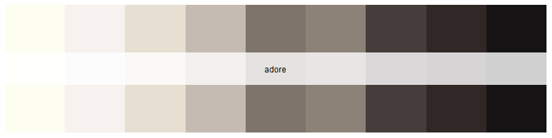
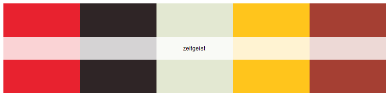
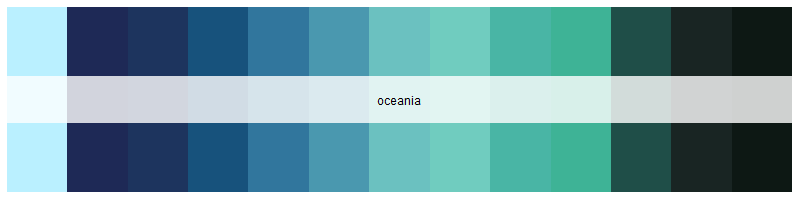
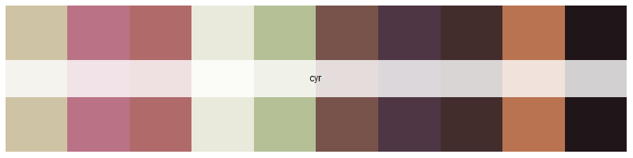

<!-- README.md is generated from README.Rmd. Please edit that file -->

```{r, include = FALSE}
knitr::opts_chunk$set(
  collapse = TRUE,
  comment = "#>",
  fig.path = "man/figures/README-",
  out.width = "100%"
)
```

# SmashingPumpkins

[{width="800"}](images/mellon_collie.jpg)

<!-- badges: start -->

[](https://github.com/pwarncke77/SmashingPumpkins/actions/workflows/R-CMD-check.yaml)

<!-- badges: end -->

SmashingPumpkins provides color palettes based on the iconic album covers by 'The Smashing Pumpkins'. Modeled after karthik/wesanderson (<https://github.com/karthik/wesanderson>), this package provides vectors of hexadecimal color codes to visually enhance plotting in R.

## Installation

You can install the development version of SmashingPumpkins from [GitHub](https://github.com/) with:

``` r
# install.packages("devtools")
devtools::install_github("pwarncke77/SmashingPumpkins")
```

## Example usage:

```{r example}
library(SmashingPumpkins)
library(ggplot2)

ggplot(iris, aes(x = Sepal.Length, y = Petal.Length, color = Species, shape = Species))+
  geom_point(size = 3.6)+
  scale_color_manual(values = SmashingPumpkins::pumpkins_palette("mellon_collie")[3:5])+
  theme_minimal()

ggplot(mtcars, aes(x = mpg, fill = as.factor(cyl)))+
  geom_density(alpha = 0.8, bw = 0.9)+
  scale_fill_manual(values = SmashingPumpkins::pumpkins_palette("mellon_collie")[1:3])+
  ylab("")+
  theme_dark()

```

## All available color palettes

### Gish (1991)

``` r
SmashingPumpkins::pumpkins_palette("gish")

```

[](images/gish.png)

### Gish (1991) dark

``` r
SmashingPumpkins::pumpkins_palette("gish_dark")
```


[](images/gish_dark.png)

### Gish (1991) light

``` r
SmashingPumpkins::pumpkins_palette("gish_light")
```

[](images/gish_light.png)

### Siamese Dream (1993):

``` r
SmashingPumpkins::pumpkins_palette("siamese_dream")
```

[](images/simamese_dream.png)

### Siamese Dream (1993) dark:

``` r
SmashingPumpkins::pumpkins_palette("siamese_dream_dark")
```


[](images/simamese_dream_dark.png)

### Siamese Dream (1993) light:

``` r
SmashingPumpkins::pumpkins_palette("siamese_dream_light")
```

[](images/simamese_dream_light.png)

### Siamese Dream reissue (2011):

``` r
SmashingPumpkins::pumpkins_palette("siamese_dream_re")
```

[](images/simamese_dream_re.png)

### Mellon Collie and the Infinite Sadness (1995):

``` r
SmashingPumpkins::pumpkins_palette("mellon_collie")
```


[](images/mellon_collie.png)

### Mellon Collie and the Infinite Sadness (1995) dark:

``` r
SmashingPumpkins::pumpkins_palette("mellon_collie_dark")
```

[](images/mellon_collie_dark.png)

### Mellon Collie and the Infinite Sadness (1995) light:

``` r
SmashingPumpkins::pumpkins_palette("mellon_collie_dark")
```

[](images/mellon_collie_light.png)

### Adore (1998):

``` r
SmashingPumpkins::pumpkins_palette("adore")
```

[](images/adore.png)

### Zeitgeist (2007):

``` r
SmashingPumpkins::pumpkins_palette("zeitgeist")
```

[](images/zeitgeist.png)

### Oceania (2012):

``` r
SmashingPumpkins::pumpkins_palette("oceania")
```

[](images/oceania.png)

### Cyr (2020):

``` r
SmashingPumpkins::pumpkins_palette("cyr")
```

[](images/cyr.png)
