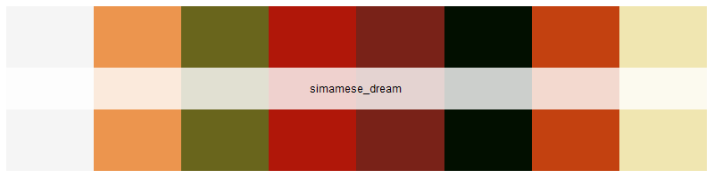

<!-- README.md is generated from README.Rmd. Please edit that file -->

# SmashingPumpkins

[](images/mellon_collie.jpg)

<!-- badges: start -->

[](https://github.com/pwarncke77/SmashingPumpkins/actions/workflows/R-CMD-check.yaml)

<!-- badges: end -->

SmashingPumpkins provides color palettes based on the iconic album
covers by ‘The Smashing Pumpkins’. Modeled after karthik/wesanderson
(<https://github.com/karthik/wesanderson>), this package provides
vectors of hexadecimal color codes to visually enhance plotting in R.

## Installation

You can install the development version of SmashingPumpkins from
[GitHub](https://github.com/) with:

``` r
# install.packages("devtools")
devtools::install_github("pwarncke77/SmashingPumpkins")
```

## Example usage:

``` r
library(SmashingPumpkins)
## basic example code
```

## All available color palettes

### Gish (1991)

gish

[](images/gish.png)

### Gish (1991) dark

gish_dark

[](images/gish_dark.png)

### Gish (1991) light

gish_light

[](images/gish_light.png)

### Siamese Dream (1993):

siamese_dream

[](images/simamese_dream.png)

### Siamese Dream (1993) dark:

siamese_dream_dark

[](images/simamese_dream_dark.png)

### Siamese Dream (1993) light:

siamese_dream_light

[](images/simamese_dream_light.png)

### Siamese Dream reissue (2011):

siamese_dream_re

[](images/simamese_dream_re.png)

### Mellon Collie and the Infinite Sadness (1995):

mellon_collie

[](images/mellon_collie.png)

### Mellon Collie and the Infinite Sadness (1995) dark:

mellon_collie_dark

[](images/mellon_collie_dark.png)

### Mellon Collie and the Infinite Sadness (1995) light:

mellon_collie_dark

[](images/mellon_collie_light.png)

### Adore (1998):

adore

[](images/adore.png)

### Zeitgeist (2007):

zeitgeist

[](images/zeitgeist.png)

### Oceania (2012):

oceania

[](images/oceania.png)

### Cyr (2020):

cyr

[](images/cyr.png)
